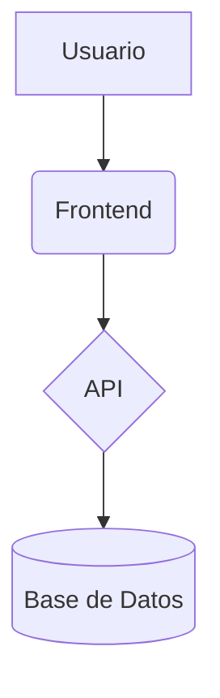

# Guideline Sync CLI - Documentación de Uso

## 📖 Descripción

`guideline-sync` es una herramienta de línea de comandos que analiza tu proyecto usando `repomix` y genera automáticamente documentación técnica completa con IA (Gemini) y directrices de desarrollo personalizadas desde el Hub centralizado de AI Dome.

## 🚀 Instalación

### Instalación Local (Desarrollo)

```bash
# Clonar el repositorio
git clone <repository-url>
cd ai-dome-hub/apps/cli

# Instalar dependencias
pnpm install

# Instalar repomix globalmente
npm install -g repomix

# Usar directamente
node bin/guideline-sync.js --help
```

### Instalación Global (Futuro)

```bash
# Cuando esté publicado en npm
npm install -g @ai-dome/guideline-sync
guideline-sync --help
```

## 🎯 Uso Básico

### Comando Principal - `init`

```bash
# Generar documentación completa del proyecto actual
guideline-sync init

# Con información detallada
guideline-sync init --verbose

# Especificar archivo de salida personalizado
guideline-sync init --output mi-documentacion.md
```

### Opciones Disponibles

| Opción | Descripción | Valor por defecto |
|--------|-------------|-------------------|
| `--output, -o <file>` | Archivo de salida para la documentación | `GEMINI_GUIDELINES.md` |
| `--hub-url <url>` | URL del Hub de AI Dome | `http://localhost:3000` |
| `--verbose, -v` | Mostrar información detallada del proceso | `false` |

## 🧩 Uso en Otros Proyectos (Desarrollo Local)

Si quieres probar el CLI en cualquier otro proyecto de tu sistema sin publicarlo en npm, puedes enlazarlo globalmente usando `pnpm link`. Esto permite ejecutar `guideline-sync` en cualquier carpeta y ver los cambios al instante.

### Pasos para Enlazar Globalmente

1. **Enlaza el CLI globalmente desde el monorepo:**
   ```bash
   cd /Users/admin-roberto/des/ai-dome-hub/apps/cli
   pnpm link --global
   ```

2. **Ve al directorio de tu otro proyecto:**
   ```bash
   cd /ruta/a/tu/otro-proyecto
   ```

3. **Ejecuta el CLI como si estuviera instalado globalmente:**
   ```bash
   guideline-sync init
   # O con opciones:
   guideline-sync init --verbose --output GEMINI_GUIDELINES.md
   ```

> **Nota:** Cualquier cambio que hagas en el código fuente de `apps/cli` se reflejará automáticamente en todos los proyectos donde uses el comando enlazado.

4. **Para desvincular el CLI globalmente:**
   ```bash
   cd /Users/admin-roberto/des/ai-dome-hub/apps/cli
   pnpm unlink --global
   ```

Esto es ideal para desarrollo y testing antes de publicar el paquete en npm.

## 📝 Ejemplos de Uso

### 1. Generar Documentación Completa

```bash
# Generar documentación completa del proyecto
guideline-sync init
```

**Salida típica:**
```
� Ejecutando repomix para analizar el proyecto...
� Contexto generado: 15,234 caracteres
� Enviando al Hub para generar documentación...
🤖 Generando documentación con IA...
📋 Obteniendo directrices internas...
✅ Documentación generada exitosamente!
📄 Archivo creado: GEMINI_GUIDELINES.md
```

### 2. Con Información Detallada

```bash
# Generar con información detallada del proceso
guideline-sync init --verbose
```

**Salida con verbose:**
```
🔄 Ejecutando repomix para analizar el proyecto...
📁 Directorio de trabajo: /mi-proyecto
📊 Contexto generado: 15,234 caracteres
📦 Dependencias encontradas: 23
🚀 Enviando al Hub para generar documentación...
🌐 URL del Hub: http://localhost:3000/api/generar-documentacion-completa
🤖 Generando documentación con IA...
🏷️ Tecnologías detectadas: React, Next.js, TypeScript, Tailwind CSS
📋 Obteniendo directrices internas...
📚 Directrices encontradas: 12
✅ Documentación generada exitosamente!
📄 Archivo creado: GEMINI_GUIDELINES.md (23,567 bytes)
```

### 3. Archivo de Salida Personalizado

```bash
# Guardar en un archivo específico
guideline-sync init --output docs/project-guidelines.md
```

### 4. Usar Hub Remoto

```bash
# Conectar a un Hub en producción
guideline-sync init --hub-url https://ai-dome-hub.company.com
```

## 🎨 Salida y Formatos

### Archivo de Documentación Generado

El archivo `GEMINI_GUIDELINES.md` generado incluye:

```markdown
# [Nombre del Proyecto] - Documentación Técnica

Generado automáticamente el: [fecha y hora]

## Resumen del Proyecto

[Descripción generada por IA basada en el análisis del código]

## Tecnologías Principales

[Lista de tecnologías detectadas automáticamente]

## Estructura del Repositorio

[Árbol de directorios completo del proyecto]

## Arquitectura General

[Descripción de la arquitectura recomendada]



## Directrices de Desarrollo

### [Área 1 - ej: Frontend]

#### [Directriz específica - ej: React Best Practices]
[Contenido detallado de la directriz]

### [Área 2 - ej: Backend]
...

## Directrices Transversales

[Directrices que aplican a todo el proyecto]
```

### Información en Consola

En modo normal:
- 🔄 Estado del proceso
- ✅ Confirmación de éxito
- 📄 Ubicación del archivo generado

En modo verbose (`--verbose`):
- 📁 Directorio de trabajo
- 📊 Estadísticas del contexto
- 🏷️ Tecnologías detectadas
- 📋 Directrices encontradas
- 🌐 URL del Hub utilizada
- 📄 Tamaño del archivo generado

## ⚡ Casos de Uso Comunes

### Inicialización de Proyecto

```bash
# Al empezar un nuevo proyecto
cd mi-nuevo-proyecto
guideline-sync init
# Revisa GEMINI_GUIDELINES.md para arquitectura recomendada
```

### Documentación de Proyecto Existente

```bash
# Documentar un proyecto existente
guideline-sync init --verbose
# Obtén documentación completa + directrices personalizadas
```

### Workflow de CI/CD

```bash
# En pipeline de CI/CD
#!/bin/bash
if guideline-sync init --hub-url $PRODUCTION_HUB_URL; then
  echo "Documentación actualizada"
  git add GEMINI_GUIDELINES.md
  git commit -m "docs: update project guidelines"
else
  echo "Error generando documentación"
  exit 1
fi
```

### Onboarding de Desarrolladores

```bash
# Generar documentación para nuevos desarrolladores
guideline-sync init
# El archivo GEMINI_GUIDELINES.md sirve como documentación de onboarding
```

## 🐛 Troubleshooting

### Error: repomix no encontrado

```
❌ Error: repomix no está instalado
```

**Solución:**
```bash
npm install -g repomix
```

### Error: No se pudo conectar al Hub

```
❌ Error: No se pudo conectar al Hub
```

**Solución:**
1. Verificar que el Hub esté ejecutándose: `curl http://localhost:3000/api/health`
2. Verificar la URL del Hub: `guideline-sync init --hub-url http://localhost:3000`
3. Verificar conectividad de red

### Error: GEMINI_API_KEY no configurada

```
❌ Error: GEMINI_API_KEY environment variable is required
```

**Solución:**
Configurar la variable de entorno en el servidor del Hub (no en el CLI)

### El archivo generado está vacío o incompleto

**Posibles causas:**
1. El proyecto no tiene package.json
2. repomix no genera contexto suficiente
3. Error en la comunicación con Gemini AI

**Solución:**
1. Verificar que existe package.json: `ls -la package.json`
2. Probar repomix manualmente: `repomix`
3. Ejecutar con verbose: `guideline-sync init --verbose`

### Timeout o respuesta lenta

**Solución:**
1. Verificar conexión a internet
2. El proceso puede tardar debido a la generación de IA (es normal)
3. Proyectos muy grandes pueden tardar más tiempo

## 📚 Más Información

- **Documentación del Sistema**: Ver `ARQUITECTURA_Y_FLUJO.md`
- **Guía de Debugging**: Ver `docs/debugging-guide.md`
- **Plan de Implementación**: Ver `PLAN_DE_ACCION.md`

## 🤝 Contribución

Para contribuir al CLI:

1. Fork el repositorio
2. Crear una rama para tu feature
3. Añadir tests si es necesario
4. Crear un pull request

### Desarrollo Local

```bash
# Clonar y configurar
git clone <repo>
cd ai-dome-hub/apps/cli
pnpm install

# Instalar repomix globalmente
npm install -g repomix

# Probar cambios
node bin/guideline-sync.js init

# Ejecutar linting
pnpm lint
```

## 🔧 Requisitos del Sistema

- **Node.js**: v18 o superior
- **repomix**: Instalado globalmente
- **Conectividad**: Acceso al Hub de AI Dome
- **Sistema operativo**: Compatible con Windows, macOS, Linux
